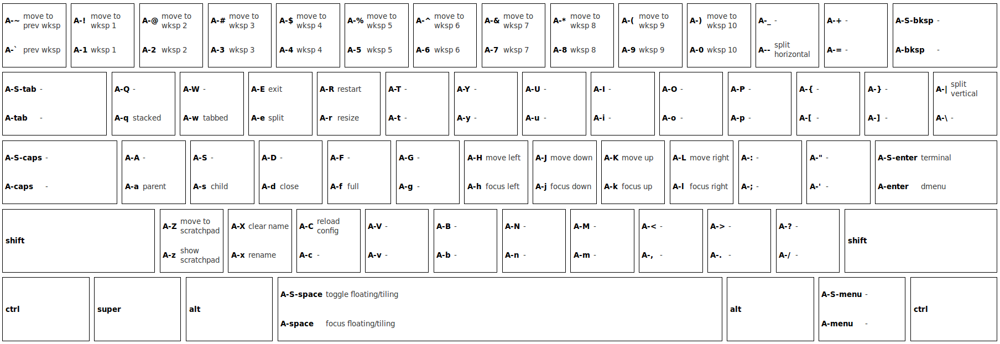

# keyboard-cheatsheet-tool

A tool to create "cheat sheets" for keyboard shortcuts.

**You can [try a live demo](http://keyboardfire.com/keyboard-cheatsheet-tool) hosted on my website** (which pulls the JS code directly from this repo).

Example screenshot and exported data, for my i3 config (click to enlarge):

    {"rows":[["shift","alt"],["alt"]],"data":["move to prev wksp","prev wksp","move to wksp 1","wksp 1","move to wksp 2","wksp 2","move to wksp 3","wksp 3","move to wksp 4","wksp 4","move to wksp 5","wksp 5","move to wksp 6","wksp 6","move to wksp 7","wksp 7","move to wksp 8","wksp 8","move to wksp 9","wksp 9","move to wksp 10","wksp 10","-","split horizontal","-","-","-","-","-","-","-","stacked","-","tabbed","exit","split","restart","resize","-","-","-","-","-","-","-","-","-","-","-","-","-","-","-","-","split vertical","-","-","-","-","parent","-","child","-","close","-","full","-","-","move left","focus left","move down","focus down","move up","focus up","move right","focus right","-","-","-","-","terminal","dmenu","move to scratchpad","show scratchpad","clear name","rename","reload config","-","-","-","-","-","-","-","-","-","-","-","-","-","-","-","toggle floating/tiling","focus floating/tiling","-","-"]}
